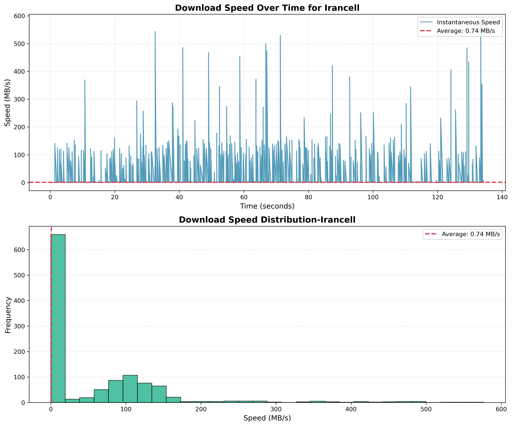

# Download Speed Monitor

A simple Python script to: 
* download a file
* show progress
* measure download speed in real-time.
---

## Features

- Shows a progress bar while downloading.
- Measures instant and average speed (MB/s).
- Prints minimum, maximum, and standard deviation of speed.
- Plots speed over time and speed distribution.
- Saves the plot as `download_speed_analysis.png`.

---

## Installation

Install required libraries:
```bash
pip install requests matplotlib tqdm
```

---
## How to Use

1. Set your download URL in `test_url`, e.g.:
```bash 
test_url = "https://speed.cloudflare.com/__down?bytes=52428800" # 50 MB file
```
2. Run the script:
```bash
python speed-monitor.py
```
3. Watch the progress bar and stats. The speed plots will display and save automatically.

---

## Notes

- Use HTTP URLs if you get SSL errors.
- Download speed depends on your internet connection.
- You can change the file size by modifying the `bytes` parameter in the URL.
---

## Sample Output Image




